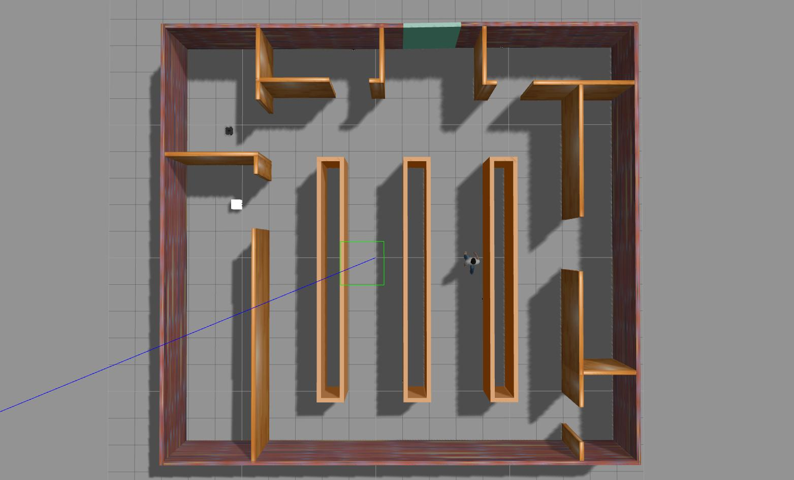
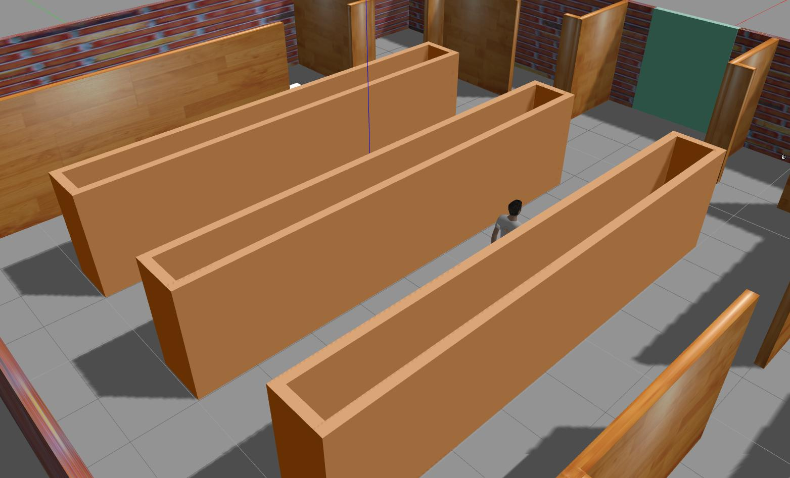
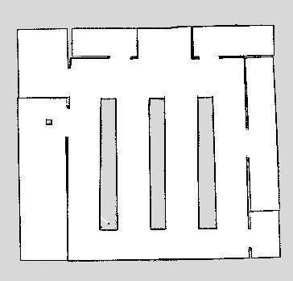
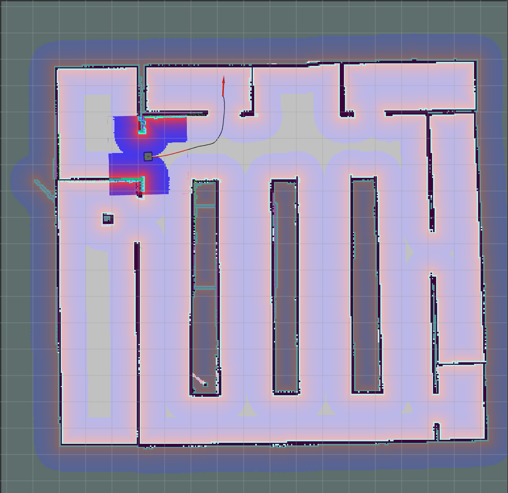
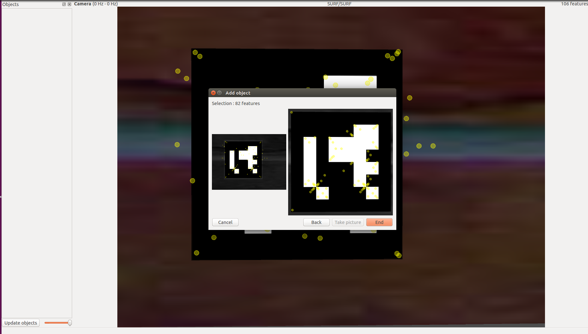
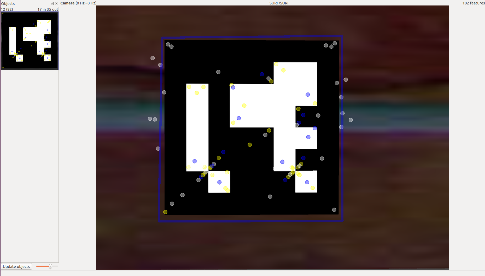
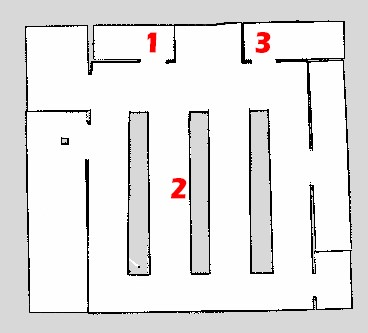

# Warebot: ROS Intelligent Robot System Project

By [Edmund Ngu](https://www.linkedin.com/in/edmund-ngu-jan-piew) and Jaden Chen, Computer Science Undergraduate (Major in Intelligent Machine) from
[Faculty of Information Science & Technology (FTSM)](http://www.ftsm.ukm.my/),<br>
[The National University of Malaysia / Universiti Kebangsaan Malaysia (UKM)](https://www.ukm.my)

**Course: TTTC2343 Intelligent Robot System**

## Contents
- [Introduction](#introduction)
- [Features](#features)
- [Simulation Environment in Gazebo](#simulation-environment-in-gazebo)
- [Techniques](#techniques)
- [AruCo Location](#aruco-location)
- [Implementation](#implementation)
- [Working Environment](#working-environment)
- [Video](#video)
- [References](#references)

## Introduction

Warebot is a robot system work as a warehouse worker. As you can see, the name **Warebot** come from **_Ware_**house + ro**_bot_**.

Warebot works to receive the order at counter, move to the specified shelf/rack to take the items, and drop it at the drop point in the warehouse.

The purpose of this project is to build a robot system in Gazebo with ROS programming to stimulate the workflow.


## Features
1. Autonomous Navigation

    Moving from Point A to Point B.

2. Object Following

    - Following known object.
    
    - Detect ArUco and follow the rules based on the ArUco.

## Simulation Environment in Gazebo
Warehouse
<div align="center">
    
</div>

Rack
<div align="center">
    
</div>

## Techniques

1. SLAM (Simultaneous Localization and Mapping)
    - To create a map of environment by predicting the real-time location of robot position in arbitary space.

<div align="center">
    
</div>

2. Rviz (ROS Visualization)

<div align="center">
    
</div>

3. find_object_2d + ArUco

<div align="center">
    
    
</div>

## ArUco Location

<div align="center">
    
</div>

## Implementation
How to Work (Step).

### Preparation

1. Copy the ArUco Model package in /aruco_model folder to Gazebo Model directory
    ```
    $HOME/<USER>/.gazebo/models
    ```

2. Copy the warebot folder to your catkin workspace and catkin_make it in terminal.
    ```sh
    $ catkin_make
    ```

### Step 1: (In 1st terminal tab)

- Run warebot_mission

    ```sh
    $ roslaunch warebot warebot_mission.launch
    ```

### Step 2: (In 2nd terminal tab)

In directory /warebot/maps/, change the image path point to the map.pgm in map.yaml file as follow:

```
image: <your path>/map.pgm
```

- Run Rviz


    ```sh
    $ export TURTLEBOT3_MODEL=waffle_pi
    ```
    
    ```sh
    $ roslaunch turtlebot3_navigation turtlebot3_navigation.launch map_file:=$HOME/catkin_ws/src/warebot/warebot/maps/map.yaml
    ```

### Step 3:

Since this is not a perfect work, use 2D Pose Estimate in Rviz to adjust the map position.

### Step 4: 

Press **s** to start.

**Done!** 

## Working Environment
OS: Ubuntu 16.04 LTS

Software: Gazebo 

Machine Model: waffle_pi (turtlebot)

## Video
Simulation of Warebot.

Youtube: [Warebot](https://www.youtube.com/watch?v=LTSf_dw2-z8&feature=youtu.be)

## References
1. [Visual object recognition by Husarion](https://husarion.com/tutorials/ros-tutorials/4-visual-object-recognition/)

## License

Copyright &copy; 2020, [Edmund Ngu](https://www.linkedin.com/in/edmund-ngu-jan-piew) and Jaden Chen.